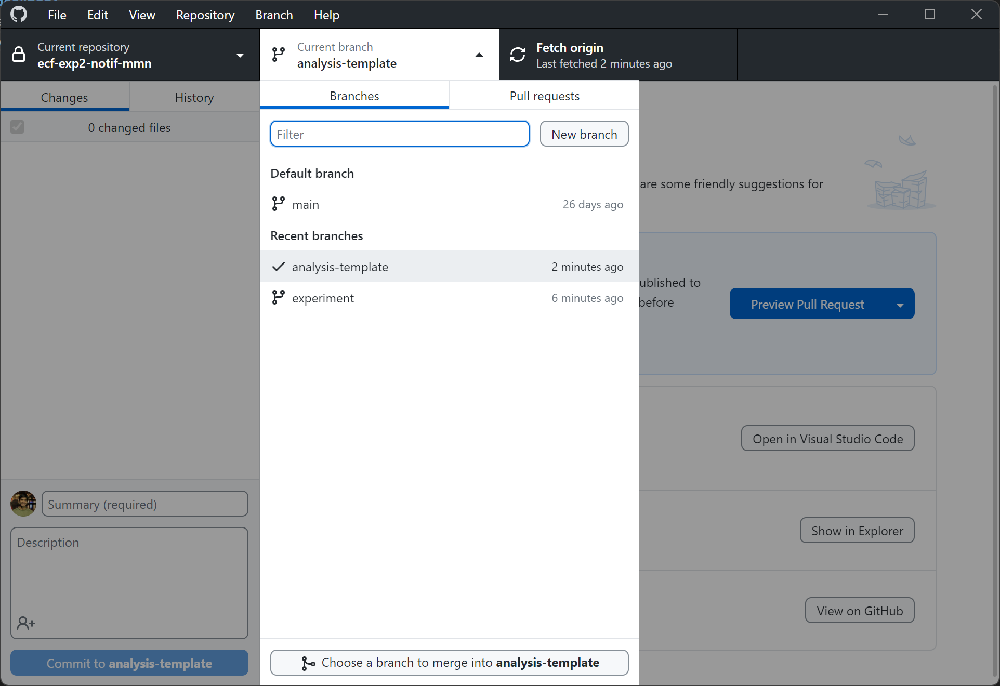

Use this branch as a starting point to create your own private analysis branch. This branch does not have docs and references folders. You can update those directly on the Github website.

In this branch you can create all the mess of notebooks and scripts you need. Once things are finalized and clean, they can be added to the main branch.

You can use some sample data from the full experimental dataset in this branch for your work. No need to include the qhole dataset in this branch.

## To create your own analysis branch:
### In github desktop:
1. Open the analysis-template branch
2. Create a new branch and give it your name

3. Start working in your own branch!
## 1. Project related discussion and weekly updates
All project related discussion will happen through `issues` on `Github.com`. Create the first issue named `Main discussion thread` if it is not already present and add the overall goal of the project there.  

In our weekly meetings, we will decide action items that you need to work on. These should be added appropriately as new issues or continued discussions in existing issues, and appropriately referenced in the Main discussion thread. Also assign the issues to yourself or whoever is responsible for them systematically.

For each weekly meeting you should create a `milestone` on Github.com. All the action items that we discuss for the next week should be assigned to the next milestone. Once you finish that action item, you can add the results to the corresponding issue. That way the results are automatically collected together in the milestone before our next meeting.

## 2. References
All project related reading you do should be added as PDFs to the references folder. The files should be named following the convention `author et al_year_title.pdf`. Refer to this file in your issues when you refer to the paper. Typically you will also have an issue related to reading the paper where you can summarize whatever was relevant in the paper to our project.  

**Remember to switch to the main branch before adding references to this folder.** Otherwise it will become difficult to track references scattered across branches. This matters only if you every create other branches for your analysis code.  

I recommend using `Zotero` for managing your references. It is easy to use, light-weight, free of charge and free of crap. And has all the goodies to integrate it with your choice word processors.

## 3. Experiments
If you are designing an experiment, all experiment files should go in the `experiment` folder. Please follow the following steps:
1. Create a new branch on Github named `experiment` if it does not already exist. Typically it should exist.
2. Install `github desktop` on the computer on which the experiment will live, and clone this repository there.
3. Switch to the `experiment` branch.
4. Create the experiment directly in the experiment folder of this repository only.
5. **Every time you update the experiment, commit the changes to git including a short description of what you changed.** You can use github desktop for doing this efficiently.

## 4. Analysis code

The `analysis` folder should be used for keeping all your code and Jupyter notebooks.  
1. **This folder must contain a `requirements.txt` file.** This file keeps track of all the Python packages and their versions that you use in your analysis.
2. Keep this file updated by regularly running `pip freeze > requirements.txt`
3. Create your own branch from the analysis-template branch for all your analysis. Only final scripts and notebooks can be copied to the main branch after they are confirmed to work.
4. Add proper `library` and `notebooks` folders to keep the code organized nicely.
5. Commit regularly, and **surely when you complete an issue**, and include a proper commit message and description.

## 5. Data
All data should live in the `data` folder. There are two sub-folders by default - `raw` and `processed`. As the names suggest, raw data should go in `raw` folder. All the results of your processing should go in the `processed` folder. As needed, add other required structure to keep the data well-organized.  

